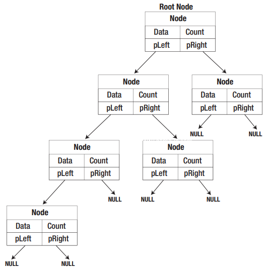

# c-sorting-using-a-binary-tree
:rabbit: # Classificando inteiros usando uma árvore binária

Uma árvore binária é uma maneira útil de organizar dados porque os dados armazenados em uma árvore binária podem ser extraídos de maneira ordenada.
Uma árvore binária consiste em um conjunto de elementos interconectados chamados de nós.
O nó inicial é a base da árvore e é chamado de nó raiz.



### Output:

```
Enter the node value: 1
Do you want to enter another (y or n) ? y

Enter the node value: 5
Do you want to enter another (y or n) ? y

Enter the node value: 2
Do you want to enter another (y or n) ? y

Enter the node value: 6
Do you want to enter another (y or n) ? y

Enter the node value: 123
Do you want to enter another (y or n) ? y

Enter the node value: 3
Do you want to enter another (y or n) ? n
```

The values in ascending sequence are:
```
1 x 1
1 x 2
1 x 3
1 x 5
1 x 6
1 x 123
```

The values in descending sequence:
```
...
```

